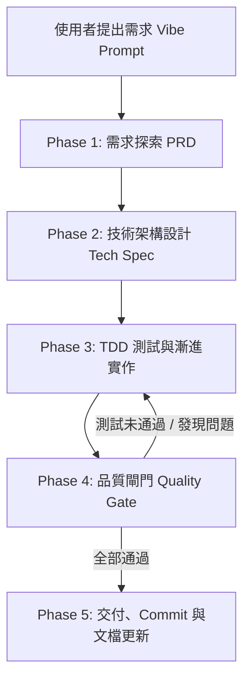

# SDLC Workflow Specification - 軟體開發生命週期標準

> 本規範定義專案中所有 Agent 與工程師在執行功能開發、漏洞修復與架構重構時必須遵循的標準流程。

---

## 流程概覽 (Overview)

---

## Phase 1: 需求探索與定義 (PRD Inception)

### 目的
將自然語言的粗略想法（Vibe）轉化為結構清晰、邊界明確、具備可驗收標準的需求文件。

### 執行要點
1. 使用 [01_PRD_TEMPLATE.md](file:///d:/AI%20Agent/StampVue/docs/sdlc/01_PRD_TEMPLATE.md) 建立需求文件。
2. 釐清以下關鍵問題：
   - **目標使用者 (Target User)** 是誰？
   - **核心痛點 (Pain Point)** 與欲解決的問題是什麼？
   - **核心使用者故事 (User Stories)**：`身為 [角色]，我希望 [操作]，以便 [效益]`。
   - **非目標 (Out of Scope)**：明確標記本次迭代不做什麼。
   - **驗收標準 (Acceptance Criteria - AC)**：使用 Given-When-Then 或清單格式。

---

## Phase 2: 技術架構與方案設計 (Tech Spec & Architecture)

### 目的
在不寫生產代碼前，完成系統設計、資料庫/資料模型、API 介面定義與技術風險評估。

### 執行要點
1. 使用 [02_TECH_SPEC_TEMPLATE.md](file:///d:/AI%20Agent/StampVue/docs/sdlc/02_TECH_SPEC_TEMPLATE.md) 建立技術設計書。
2. 設計內容包含：
   - **架構設計 (System Architecture)**：組件交互圖、狀態管理方式。
   - **資料模型 (Data Models)**：Schema 定義、關聯與欄位驗證。
   - **API / 介面契約 (API Contracts)**：請求/回應結構、錯誤碼定義。
   - **潛在風險與替代方案 (Trade-offs & Risks)**：效能、安全、擴展性評估。
3. 建立 [03_TASK_CHECKLIST_TEMPLATE.md](file:///d:/AI%20Agent/StampVue/docs/sdlc/03_TASK_CHECKLIST_TEMPLATE.md) 進行任務原子化拆解（每項任務預計 10~30 分鐘可完成）。

---

## Phase 3: 測試驅動與漸進實作 (TDD & Implementation)

### 目的
以最小風險的方式分片（Vertical Slice）實現功能，代碼具備即時可驗證性。

### 執行要點
1. **測試先行 (Test-First)**：
   - 根據 Phase 1 的驗收標準 (AC) 撰寫單元測試或整合測試。
   - 確保測試在實作前會失敗 (Red)。
2. **漸進開發 (Incremental Development)**：
   - 每次只實現一個小功能片段或函式。
   - 實現後立即執行測試驗證 (Green)。
   - 進行代碼重構，保持簡潔 (Refactor)。
3. **拒絕一次性巨量改動**：
   - 每次修改檔案範圍保持聚焦，避免跨十幾個檔案的未知改動。

---

## Phase 4: 品質閘門 (Quality Gate & Review)

### 目的
嚴格攔截低品質代碼、安全隱患、效能瓶頸或潛在 Bug。

### 執行要點
1. 參考 [04_QUALITY_GATE_CHECKLIST.md](file:///d:/AI%20Agent/StampVue/docs/sdlc/04_QUALITY_GATE_CHECKLIST.md) 進行自我檢查。
2. **自動化驗證**：
   - 所有單元測試與整合測試 100% 通過。
   - 型別檢查 (Typecheck / TypeScript) 零錯誤。
   - Linter / Code Formatter 檢查無告警。
   - 無 Hardcoded 機密金鑰、Token 或敏感資訊。
3. **Agent 自我代碼審查 (Self-Review)**：
   - 檢查是否有多餘的 debug console.log / print。
   - 檢查邊界條件（null/undefined、空陣列、網路超時、非預期型別）是否有容錯處理。

---

## Phase 5: 交付與文檔更新 (Delivery & Changelog)

### 目的
確保變更具備清晰的歷史軌跡，並維持文檔與代碼的一致性。

### 執行要點
1. 更新相關文檔（API 文件、使用者指南、README）。
2. 遵循 [git-workflow.md](file:///.agents/rules/git-workflow.md) 規範提交 Commit。
3. 記錄本次改動之 Release Note / Changelog。
