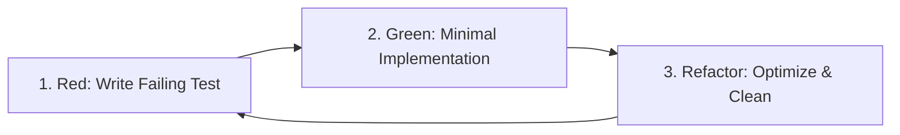

# Test-Driven Development (TDD) Skill

This skill enforces the **Red-Green-Refactor** lifecycle, ensuring all core business logic, utility algorithms, and API contracts are guarded by automated tests before and during production implementation.

---

## TDD Core Rules & Cycle



1. **Test-First (Red)**:
   - Write tests based on the Acceptance Criteria (AC) from the PRD / Tech Spec.
   - Run the test suite and verify that the test fails for the expected reason (e.g., function not defined, assertion failed).
2. **Minimal Code (Green)**:
   - Write only enough production code required to satisfy the failing test.
   - Run the test suite and verify green.
3. **Refactor (Clean & Robust)**:
   - Eliminate duplication, improve naming, optimize algorithmic complexity.
   - Run tests again to ensure zero regressions.
4. **No Naked Logic**:
   - Complex algorithms, edge cases, error handlers, and boundary scenarios MUST have corresponding tests.

---

## Test Organization & Naming Conventions

- **File Naming**: Place tests alongside code or in dedicated `tests/` directories using `<target>.test.ts` or `<target>.spec.ts`.
- **Test Structure (AAA Pattern)**:
  - **Arrange**: Set up mocks, inputs, fixtures.
  - **Act**: Execute the target function or trigger the operation.
  - **Assert**: Validate outputs, side effects, and state mutations.
- **Descriptive Descriptions**:
  ```typescript
  describe('StampExtractorService', () => {
    describe('extractStamp()', () => {
      it('should isolate red hue pixels and discard dark background shadows', async () => {
        // Arrange
        // Act
        // Assert
      });

      it('should throw ValidationError when input image buffer is corrupt or empty', async () => {
        // Arrange
        // Act & Assert
      });
    });
  });
  ```

---

## Test Execution Commands for this Workspace

- **Run Backend Tests**: `npm.cmd test --prefix backend` or `npx vitest run` (inside `backend/`)
- **Run Watch Mode**: `npm.cmd run test:watch --prefix backend` or `npx vitest`
- **Run Specific Test**: `npx vitest run tests/<filename>.test.ts`
- **Type Checking**: `npm.cmd run typecheck`
