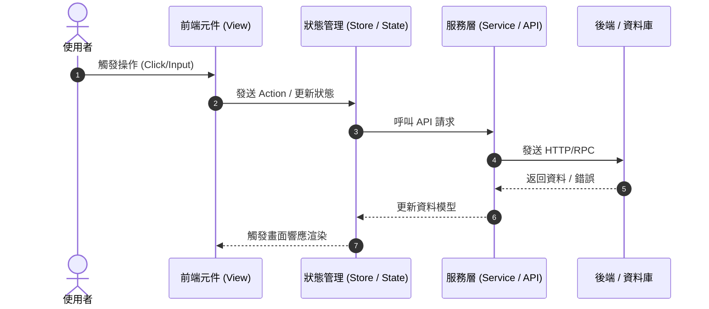

# Tech Spec: [功能技術規格 / Technical Specification]

> **關聯 PRD**: [PRD 文件連結](file:///docs/sdlc/01_PRD_TEMPLATE.md)  
> **架構設計人**: [Agent / 架構師]  
> **狀態**: 評審中 (In Review) / 已定案 (Finalized)  
> **最後更新**: YYYY-MM-DD  

---

## 1. 架構設計與資料流 (System Architecture & Data Flow)



---

## 2. 資料模型與介面契約 (Data Models & Contracts)

### 2.1 型別定義 (TypeScript / Schema)
```typescript
export interface ExamplePayload {
  id: string;
  title: string;
  amount: number;
  status: 'draft' | 'published' | 'archived';
  createdAt: string;
}

export interface ExampleResponse {
  success: boolean;
  data?: ExamplePayload;
  errorMessage?: string;
}
```

### 2.2 API 端點設計 (Endpoints)
- **POST `/api/v1/example`**: 建立新項目
  - Request: `ExamplePayload`
  - Response: `201 Created` / `400 Bad Request` / `500 Server Error`

---

## 3. 相依性與技術選型 (Dependencies & Trade-offs)

| 選用技術 / 庫 | 評估考量 (Why) | 替代方案與權衡 (Trade-offs) |
|---|---|---|
| Zod | 執行時期資料驗證，型別推導完整 | Joi / Yup (社群生態與包體大小考量) |
| Vitest | 極速單元測試，原生支援 ESM/Vite | Jest (設定較繁瑣) |

---

## 4. 錯誤處理與邊界條件 (Error Handling & Edge Cases)

1. **網路超時 (Timeout)**：重試最多 3 次，間隔指數退避 (Exponential Backoff)。
2. **非預期資料格式**：使用 Schema 驗證攔截，記錄警告日誌並回傳友善錯誤。
3. **並行請求競態 (Race Conditions)**：使用 AbortController 或取消前次未完成的請求。

---

## 5. 測試策略 (Testing Strategy)
- 單元測試：針對 Service 與 Store 商業邏輯，目標覆蓋率 > 80%。
- 元件測試：測試核心 UI 元件的互動與狀態變化。
