# SPEC - 印章擷取與去背演算法技術規格 (Technical Specification)

> **版本**：v1.1.0  
> **建立日期**：2026-09-03  
> **狀態**：Implemented & Verified  
> **文件代號**：`SPEC-stamp-extractor`

---

## 1. 系統架構總覽 (System Architecture)

StampVue 採用同構雙引擎設計 (Isomorphic Dual-Engine Architecture)：
1. **Frontend Client Engine**：基於 HTML5 Canvas 2D Context 與 TypedArray (`Uint8Array`)，於瀏覽器端純本地運算，提供極致流暢之即時互動體驗。
2. **Backend Node.js Engine**：基於 Node.js + Express + `sharp` (libvips C++ 底層)，專為無頭伺服器、批次提取與高解析度後端管線設計。

```mermaid
flowchart TD
    subgraph Client [前端 Vue 3 + Canvas 引擎]
        UI[CameraCapture / FileUpload] --> RawImg[Image Element / Canvas]
        RawImg --> Rot[Canvas 旋轉校正 0~360°]
        Rot --> Pass1FE[Pass 1: 高門檻 70% 印章定位]
        Pass1FE --> FloodFill[Enclosure Contour & Flood-Fill]
        FloodFill --> BBox[印章主體 BoundingBox 裁切]
        BBox --> Pass2FE[Pass 2: 使用者門檻精細去背]
        Pass2FE --> ColorBoostFE[色彩強化與飽和度調校]
        ColorBoostFE --> FinalCanvas[即時預覽與 32-bit PNG 匯出]
    end

    subgraph Backend [後端 Node.js + Sharp 引擎]
        Req[POST /api/stamp/extract] --> SharpLoad[sharp load & auto-orient]
        SharpLoad --> RawBuf[RGBA Raw Buffer]
        RawBuf --> Pass1BE[Pass 1: 印章主體偵測定位]
        Pass1BE --> FloodFillBE[4x4 網格化閉合水淹過濾]
        FloodFillBE --> CropBE[sharp.extract boundingBox]
        CropBE --> Pass2BE[Pass 2: 門檻自適應陰影剔除]
        Pass2BE --> PngEncode[sharp.png compression: 9]
        PngEncode --> Resp[JSON Base64 / Binary PNG]
    end
```



---

## 2. 演算法數學模型與核心設計 (Algorithm Mathematical Models)

### 2.1 色彩主導模式偵測 (Auto Color Detection)
採樣全圖像素集合 $S$，步長 $\text{step} = \max(1, \lfloor |S| / 20000 \rfloor)$：
$$
\text{Diff}_{\text{red}} = R - \max(G, B), \quad \text{Diff}_{\text{blue}} = B - \max(R, G)
$$
累積統計所有滿足 $\text{Diff} > 25$ 之色差總和：
$$
\text{DominantColor} = \begin{cases} \text{'blue'}, & \sum \text{Diff}_{\text{blue}} > \sum \text{Diff}_{\text{red}} \\ \text{'red'}, & \text{otherwise} \end{cases}
$$

---

### 2.2 色彩對立色度差與非線性陰影抑制 (Color-Opponent Chromaticity & Shadow Suppression)

#### (1) 色彩對立分量差 (Color Difference)
對於目標色彩分量 $C_{\text{target}}$ 及非目標兩通道集合 $\{C_{\text{non1}}, C_{\text{non2}}\}$：
- 紅色模式：$C_{\text{target}} = R, \quad \max_{\text{non}} = \max(G, B)$
- 藍色模式：$C_{\text{target}} = B, \quad \max_{\text{non}} = \max(R, G)$
$$
\text{Diff} = C_{\text{target}} - \max_{\text{non}}
$$
若 $\text{Diff} \le 0$，該像素立即判定為背景（$\alpha = 0$）。

#### (2) 陰影感知非線性 Gamma 權重 (Luminance Gamma Shadow Factor)
陰影通常呈現低亮度（暗灰、深黑）：
$$
\gamma_{\text{shadow}} = 1.0 + \left( \frac{\text{shadowSuppression}}{100} \right) \times 1.5 \quad (\gamma \in [1.0, 2.5])
$$
$$
L = \max(R, G, B)
$$
$$
F_{\text{luminance}} = \left( \frac{\max(1, L)}{255.0} \right)^{\gamma_{\text{shadow}} - 1.0}
$$
當像素位於陰影區時，$L \ll 255$，經過指數次方壓制，$F_{\text{luminance}} \to 0$，強力抑制陰影中的微弱偏色。

#### (3) 綜合色度特徵評分 (Chromaticity Score)
加入分母平滑因子 $+15.0$ 避免暗部雜訊被除數放大：
$$
\text{Score} = \left( \frac{\text{Diff}}{L + 15.0} \right) \times 255.0 \times F_{\text{luminance}}
$$

---

### 2.3 雙階濾除流程 (Two-Pass Coarse-to-Fine Pipeline)

1. **Pass 1 (粗階定位)**：
   - 設定較高判定門檻 $\text{Threshold} = 70\%$，$\text{ShadowSuppression} = 40\%$。
   - 快速濾除微弱雜質，精準產生主印章二值化蒙版 (Binary Mask)。
2. **Pass 2 (精細渲染)**：
   - 根據 Pass 1 產生的印章主體邊界 $\text{BoundingBox}$，裁切處理範圍。
   - 使用使用者微調的 $\text{Threshold}$、$\text{Smoothness}$ 與 $\text{ColorBoost}$ 進行全精確度平滑混色與透明度映射。

---

### 2.4 邊緣羽化平滑映射 (Smooth Hermite Alpha Mapping)
給定門檻中心值 $T$ 與平滑半徑 $S$：
$$
T = \left( \frac{\text{threshold}}{100} \right) \times 120 + 10, \quad S = \max\left(1, \frac{\text{smoothness}}{100} \times 40\right)
$$
$$
\text{LowBound} = \max(0, T - S), \quad \text{HighBound} = T + S
$$
透明度 $\alpha$ 計算遵循 Smoothstep (Hermite 曲線)：
$$
\alpha(\text{Score}) = \begin{cases} 
0, & \text{Score} \le \text{LowBound} \\ 
255, & \text{Score} \ge \text{HighBound} \\ 
\text{round}(255 \cdot (3u^2 - 2u^3)), & \text{where } u = \frac{\text{Score} - \text{LowBound}}{\text{HighBound} - \text{LowBound}} 
\end{cases}
$$

---

### 2.5 閉合外框與外側水淹雜訊清除演算法 (Enclosure Contour & Exterior Flood-Fill Eraser)

針對合約紙張上的外圍雜訊（紅筆勾記、文字、外框）：
1. **4x4 網格化降採樣 (Grid Cell Decimation)**：
   - 將影像劃分為 $4 \times 4$ 像素單元，減少 BFS 遍歷開銷達 16 倍。
   - 當單元內有效像素 $\ge 2$ 時標記佔用。
2. **型態學十字閉合 (Morphological Cross-Closing)**：
   - 填補印章邊框斷裂之缺口：若水平或垂直兩側均被佔用，則填補當前網格。
3. **外邊界水淹法 (Exterior BFS Flood-Fill)**：
   - 從影像最外緣 4 個邊框所有未被佔用的網格出發，進行廣度優先搜尋 (Queue-based BFS)。
   - 標記所有可由外部無障礙連通的網格為 `exterior = 1`。
   - 凡是被印章外框完整或半完整圍繞的內部區域，將無法被外部水淹波及。
4. **主印章連通元件聚類 (Connected Component Clustering)**：
   - 對非外側區域執行多連通元件標記，統計各連通塊的像素總數。
   - 提取最大連通塊作為主要印章實體，排除面積小於最大塊 $8\%$ 的外圍雜訊。
5. **產生精確邊界框 (BoundingBox)**：
   - 計算印章本體之 $[\text{minX}, \text{minY}, \text{maxX}, \text{maxY}]$，附加可自訂之 Padding。

---

### 2.6 色彩增強與黑化抑制 (Color Boost & De-noising)
$$
\text{BoostFactor} = 1.0 + \left( \frac{\text{colorBoost}}{100} \right) \times 0.8
$$
- 紅印模式：
  $$
  R_{\text{out}} = \min(255, \text{round}(R \cdot \text{BoostFactor})), \quad G_{\text{out}} = \text{round}(G \cdot 0.7), \quad B_{\text{out}} = \text{round}(B \cdot 0.7)
  $$
- 藍印模式：
  $$
  R_{\text{out}} = \text{round}(R \cdot 0.7), \quad G_{\text{out}} = \text{round}(G \cdot 0.8), \quad B_{\text{out}} = \min(255, \text{round}(B \cdot \text{BoostFactor}))
  $$
壓低非目標通道係數（$0.7 \sim 0.8$），有效消除筆劃邊緣的暗沉黑灰感，呈現純淨鮮明的印泥質感。

---

### 2.7 邊界背景消除與印章集中區域聚焦 (Border Background Elimination & Salient ROI Clustering)
針對拍照畫面外圍邊緣（桌面、陰影、手指、紙張邊框）：
1. **邊界接觸防護標記 (Border-Touching Invalidation)**：
   - 定義影像周邊邊界區帶 $\text{Margin} = \max(1, \lfloor \text{cols} \times 0.04 \rfloor)$ 個網格。
   - 任何連通元件其邊界框若接觸到影像最外側，且內部存在獨立印章主體時，一律排除標記為邊界雜訊。
2. **印章單鏈群集擴展 (Single-Linkage Clustering)**：
   - 以內部像素最多之核心印章為中心，動態向外吸附近鄰之印章文字、字符與邊框，同時杜絕邊界雜訊侵入。

---

### 2.8 來源模式差異化管線 (Differential Source Pipeline: Camera vs Upload)

根據使用者取得影像之來源情境，執行差異化處理管線：

1. **即時視訊拍攝 (`sourceType: 'camera'`)**：
   - **設計理念**：使用者在視訊取景器中已藉由「裁切框 (Crosshair Guide)」對準印章。
   - **快門擷取裁切 (Viewfinder Crop Box Projection)**：
     - 在快門觸發時，依據取景器容器尺寸與原始視訊解析度（$W_v, H_v$），計算 `object-fit: cover` 縮放比例 $s = \max(W_d/W_v, H_d/H_v)$ 與偏移量 $(O_x, O_y)$。
     - 將 DOM 裁切框位置精確映射為視訊畫素座標 $(\text{cropX}, \text{cropY}, \text{cropW}, \text{cropH})$，直接裁切出對準之印章區域。
   - **管線行為**：**跳過 Pass 1 粗定位與再次裁切流程**。
   - **原圖保留**：`croppedOriginalDataUrl` 為使用者在鏡頭中所選取之裁切框區域。
   - **去背運算**：直接在裁切框畫面執行 Pass 2 精細去背運算，即時輸出透明印章。

2. **選擇照片檔案 (`sourceType: 'upload'`)**：
   - **設計理念**：使用者通常上傳全頁合約、發票或 A4 文件，無即時視訊取景框輔助，需依賴演算法自動定位截取。
   - **管線行為**：**執行 Pass 1 偵測印章邊界後，裁切原圖至印章範圍**。
   - **原圖保留**：`croppedOriginalDataUrl` 裁切為緊貼印章之局部特寫。
   - **去背運算**：在裁切後的局部區域執行 Pass 2 精細去背，顯著提升大圖運算效能並自動裁除無關空白。

---

## 3. 資料結構與介面契約 (Data Types & API Contracts)

### 3.1 核心 TypeScript 型別 (`stamp.types.ts`)

```typescript
export type StampColorMode = 'auto' | 'red' | 'blue';
export type StampSourceType = 'camera' | 'upload';

export interface StampExtractionOptions {
  colorMode?: StampColorMode;      // 預設 'auto'
  threshold?: number;              // 10 ~ 100, 預設 38 ~ 40
  shadowSuppression?: number;      // 0 ~ 100, 預設 40 ~ 60
  smoothness?: number;             // 0 ~ 50, 預設 0 ~ 14
  colorBoost?: number;             // 0 ~ 100, 預設 25
  autoCrop?: boolean;              // 預設 true
  padding?: number;                // 預設 16
  rotation?: number;               // 預設 0
  sourceType?: StampSourceType;    // 'camera' | 'upload' (預設 'upload')
}

export interface BoundingBox {
  minX: number;
  minY: number;
  maxX: number;
  maxY: number;
  width: number;
  height: number;
}

export interface StampExtractionResult {
  imageBuffer: Buffer;
  mimeType: 'image/png';
  width: number;
  height: number;
  detectedColor: 'red' | 'blue';
  boundingBox?: BoundingBox;
}
```

### 3.2 後端 REST API 契約

- **路徑**：`POST /api/stamp/extract`
- **Content-Type**：`multipart/form-data` 或 `application/json`
- **Payload 範例 (Multipart)**：
  - `file`: 二進位圖檔 (JPG, PNG, WebP)
  - `threshold`: `40`
  - `shadowSuppression`: `50`
  - `colorMode`: `'auto'`
  - `autoCrop`: `'true'`
- **Payload 範例 (JSON)**：
  ```json
  {
    "image": "data:image/png;base64,iVBORw0KGgo...",
    "threshold": 40,
    "shadowSuppression": 50,
    "colorMode": "auto",
    "autoCrop": true
  }
  ```
- **成功回應 (200 OK - application/json)**：
  ```json
  {
    "success": true,
    "detectedColor": "red",
    "width": 320,
    "height": 320,
    "boundingBox": {
      "minX": 150,
      "minY": 120,
      "maxX": 470,
      "maxY": 440,
      "width": 320,
      "height": 320
    },
    "image": "data:image/png;base64,iVBORw0KGgoAAA..."
  }
  ```
- **成功回應 (二進位串流)**：
  - 帶入 Query `?format=binary` 或 Header `Accept: image/png`
  - 回傳原始二進位 `image/png`，標頭帶有 `Content-Disposition: inline; filename="stamp_extracted.png"`。
