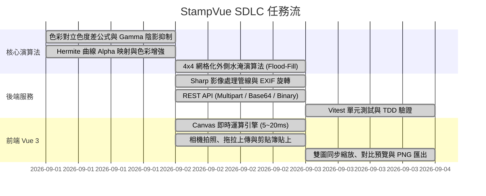

# TASKS - 印章擷取與去背系統任務拆解與進度清單 (Task Breakdown)

> **版本**：v1.1.0  
> **關聯文件**：[PRD-stamp-extractor.md](file:///d:/AI%20Agent/StampVue/docs/sdlc/PRD-stamp-extractor.md) | [SPEC-stamp-extractor.md](file:///d:/AI%20Agent/StampVue/docs/sdlc/SPEC-stamp-extractor.md)  
> **狀態**：All Completed & Verified

---

## 任務架構與縱向切片 (Vertical Slices)

---

## 任務細部狀態表

| 編號 | 階段 / 模組 | 任務描述 | 關聯檔案 | 狀態 |
|---|---|---|---|:---:|
| **T-01** | Core Algorithm | 設計色彩對立差 (Color-Opponent Diff) 計算公式與 Auto 色彩判定 | [stampExtractor.ts](file:///d:/AI%20Agent/StampVue/backend/src/services/stampExtractor.ts) | ✅ 已完成 |
| **T-02** | Core Algorithm | 實作非線性 Gamma 亮度感知陰影抑制函數 (Luminance Gamma) | [stampExtractor.ts](file:///d:/AI%20Agent/StampVue/backend/src/services/stampExtractor.ts) | ✅ 已完成 |
| **T-03** | Core Algorithm | 實作雙階濾除管線 (Two-Pass Pipeline: 70% 粗定位 + 40% 精細渲染) | [stampProcessor.ts](file:///d:/AI%20Agent/StampVue/frontend/src/utils/stampProcessor.ts) | ✅ 已完成 |
| **T-04** | Core Algorithm | 實作 4x4 網格化降採樣與外邊界水淹清除雜訊演算法 (BFS Flood-Fill) | [stampExtractor.ts](file:///d:/AI%20Agent/StampVue/backend/src/services/stampExtractor.ts) | ✅ 已完成 |
| **T-05** | Core Algorithm | 實作 Hermite Smoothstep 曲線平滑 Alpha 映射與飽和度色彩補償 | [stampExtractor.ts](file:///d:/AI%20Agent/StampVue/backend/src/services/stampExtractor.ts) | ✅ 已完成 |
| **T-06** | Backend Service | 整合 Sharp 核心載入 raw buffer、EXIF 自動旋轉與 BoundingBox 裁切 | [stampExtractor.ts](file:///d:/AI%20Agent/StampVue/backend/src/services/stampExtractor.ts) | ✅ 已完成 |
| **T-07** | Backend API | 建立 Express 路由 `/api/stamp/extract`，支援 Form-data 與 Base64 | [stampRoutes.ts](file:///d:/AI%20Agent/StampVue/backend/src/routes/stampRoutes.ts) | ✅ 已完成 |
| **T-08** | Testing (TDD) | 撰寫 Vitest 單元測試驗證純色紅印、陰影紅印與旋轉裁切邏輯 | [stampExtractor.test.ts](file:///d:/AI%20Agent/StampVue/backend/tests/stampExtractor.test.ts) | ✅ 已完成 |
| **T-09** | Frontend Engine | 將演算法完全移植至純前端 Canvas 2D / TypedArray (支援離線 60fps) | [stampProcessor.ts](file:///d:/AI%20Agent/StampVue/frontend/src/utils/stampProcessor.ts) | ✅ 已完成 |
| **T-10** | Frontend UI | 建立高擬真相機擷取元件、相機前/後鏡頭切換、檔案拖放上傳 | [CameraCapture.vue](file:///d:/AI%20Agent/StampVue/frontend/src/components/CameraCapture.vue) | ✅ 已完成 |
| **T-11** | Frontend UI | 建立參數微調面板 (門檻、陰影、平滑、飽和度、旋轉、主體邊距) | [StampControls.vue](file:///d:/AI%20Agent/StampVue/frontend/src/components/StampControls.vue) | ✅ 已完成 |
| **T-12** | Frontend UI | 實作雙向同步縮放預覽 (Pan/Zoom)、棋盤格/白底/黑底背景切換 | [ImagePreview.vue](file:///d:/AI%20Agent/StampVue/frontend/src/components/ImagePreview.vue) | ✅ 已完成 |
| **T-13** | Frontend UI | 支援一鍵無損透明 PNG 下載與系統剪貼簿複製 (Clipboard API) | [ImagePreview.vue](file:///d:/AI%20Agent/StampVue/frontend/src/components/ImagePreview.vue) | ✅ 已完成 |
| **T-14** | Core Algorithm | 實作邊界接觸元件排除與印章集中區域幾何聚類聚焦演算法 | [stampExtractor.ts](file:///d:/AI%20Agent/StampVue/backend/src/services/stampExtractor.ts) / [stampProcessor.ts](file:///d:/AI%20Agent/StampVue/frontend/src/utils/stampProcessor.ts) | ✅ 已完成 |
| **T-15** | Testing (TDD) | 撰寫邊緣拍到桌面雜訊/外圍紅線干擾之 Vitest 測試驗證 | [stampExtractor.test.ts](file:///d:/AI%20Agent/StampVue/backend/tests/stampExtractor.test.ts) | ✅ 已完成 |
| **T-16** | Core Algorithm | 實作來源差異化管線：視訊拍攝跳過 Pass 1 偵測裁切，檔案上傳保留 Pass 1 偵測裁切原圖 | [stampProcessor.ts](file:///d:/AI%20Agent/StampVue/frontend/src/utils/stampProcessor.ts) / [stampExtractor.ts](file:///d:/AI%20Agent/StampVue/backend/src/services/stampExtractor.ts) | ✅ 已完成 |
| **T-17** | UI & Testing | 前端 CameraCapture 傳遞來源標記、StampControls/Preview 視覺化標記與 TDD 單元測試 | [CameraCapture.vue](file:///d:/AI%20Agent/StampVue/frontend/src/components/CameraCapture.vue) / [stampExtractor.test.ts](file:///d:/AI%20Agent/StampVue/backend/tests/stampExtractor.test.ts) | ✅ 已完成 |
| **T-18** | Camera UI & Core | 實作視訊取景器裁切框映射投影擷取：按快門時依裁切框精準裁切視訊，再送入去背管線 | [CameraCapture.vue](file:///d:/AI%20Agent/StampVue/frontend/src/components/CameraCapture.vue) | ✅ 已完成 |
| **T-19** | Frontend UX | 隱藏照片檔案上傳模式提示條、將圖片旋轉角度控制項由步驟 2 移至步驟 3 成果檢視列 | [StampControls.vue](file:///d:/AI%20Agent/StampVue/frontend/src/components/StampControls.vue) / [ImagePreview.vue](file:///d:/AI%20Agent/StampVue/frontend/src/components/ImagePreview.vue) | ✅ 已完成 |
| **T-20** | Frontend UX | 移除複製到剪貼簿功能與按鈕，聚焦於純淨可靠之 32-bit 透明 PNG 原生下載 | [ImagePreview.vue](file:///d:/AI%20Agent/StampVue/frontend/src/components/ImagePreview.vue) | ✅ 已完成 |
| **T-21** | Frontend UX | 重構精簡排版工作室 (Compact Studio UX)：載入後收合上傳膠囊、畫布浮動旋轉工具條、高密度滑桿控制、吸底一鍵下載 | [App.vue](file:///d:/AI%20Agent/StampVue/frontend/src/App.vue) / [ImagePreview.vue](file:///d:/AI%20Agent/StampVue/frontend/src/components/ImagePreview.vue) / [CameraCapture.vue](file:///d:/AI%20Agent/StampVue/frontend/src/components/CameraCapture.vue) / [StampControls.vue](file:///d:/AI%20Agent/StampVue/frontend/src/components/StampControls.vue) | ✅ 已完成 |
| **T-22** | Frontend UX & Pipeline | 1. 移除視訊直通標籤 2. 旋轉支援直接輸入角度 3. 新影像預設以去背呈現 4. 補齊上傳相片互動取景裁切步驟 | [CameraCapture.vue](file:///d:/AI%20Agent/StampVue/frontend/src/components/CameraCapture.vue) / [ImagePreview.vue](file:///d:/AI%20Agent/StampVue/frontend/src/components/ImagePreview.vue) / [StampControls.vue](file:///d:/AI%20Agent/StampVue/frontend/src/components/StampControls.vue) | ✅ 已完成 |
| **T-23** | Frontend UX | 移除來源工具列「支援拖曳新圖覆蓋」字串、移除預覽頂部四個底色切換模式圓點 | [CameraCapture.vue](file:///d:/AI%20Agent/StampVue/frontend/src/components/CameraCapture.vue) / [ImagePreview.vue](file:///d:/AI%20Agent/StampVue/frontend/src/components/ImagePreview.vue) | ✅ 已完成 |
| **T-24** | Frontend UX & Pipeline | 1. 即時拍攝改為拍照 2. 藍印自動色彩偵測與切換 3. 印章影像來源改為印章來源 4. 去背參數微調改為去背參數 | [CameraCapture.vue](file:///d:/AI%20Agent/StampVue/frontend/src/components/CameraCapture.vue) / [StampControls.vue](file:///d:/AI%20Agent/StampVue/frontend/src/components/StampControls.vue) / [App.vue](file:///d:/AI%20Agent/StampVue/frontend/src/App.vue) / [stampProcessor.ts](file:///d:/AI%20Agent/StampVue/frontend/src/utils/stampProcessor.ts) | ✅ 已完成 |
| **T-25** | Core Algorithm & TDD | 藍印去背演算法全面升級：藍黃對立色差 (Blue-Yellow Opponent)、暗部 Gamma 補償、修復綠色通道誤植 (b*0.8 -> g*0.75)、新增真實青藍印泥 TDD 單元測試 | [stampProcessor.ts](file:///d:/AI%20Agent/StampVue/frontend/src/utils/stampProcessor.ts) / [stampExtractor.ts](file:///d:/AI%20Agent/StampVue/backend/src/services/stampExtractor.ts) / [stampExtractor.test.ts](file:///d:/AI%20Agent/StampVue/backend/tests/stampExtractor.test.ts) | ✅ 已完成 |
| **T-26** | Frontend UX & Cropper | 1. 標題改為「裁切印章」 2. 實作紅框 4 角與 4 邊正方形等比拖曳縮放 3. 按鈕改為「裁切」 4. 按鈕改為「取消」不進行去背 5. 移除引導文字 | [CameraCapture.vue](file:///d:/AI%20Agent/StampVue/frontend/src/components/CameraCapture.vue) | ✅ 已完成 |
| **T-27** | Framework Migration | 將前端專案降版遷移至 Vue 2 (Vue 2.7.16 + @vitejs/plugin-vue2)，適配 Teleport/v-model，完成編譯、型別檢查與 Dev 伺服器驗證 | [package.json](file:///d:/AI%20Agent/StampVue/frontend/package.json) / [vite.config.ts](file:///d:/AI%20Agent/StampVue/frontend/vite.config.ts) / [main.ts](file:///d:/AI%20Agent/StampVue/frontend/src/main.ts) / [CameraCapture.vue](file:///d:/AI%20Agent/StampVue/frontend/src/components/CameraCapture.vue) / [StampControls.vue](file:///d:/AI%20Agent/StampVue/frontend/src/components/StampControls.vue) | ✅ 已完成 |
| **T-28** | Frontend UX & Cropper | 在上傳相片裁切流程中增加雙維度縮放按鍵：裁切框逐步微調 (±20px) 與照片視角縮放 (50%~300% / 重設)，精確保持幾何映射無損裁切 | [CameraCapture.vue](file:///d:/AI%20Agent/StampVue/frontend/src/components/CameraCapture.vue) | ✅ 已完成 |
| **T-29** | Core UX & Parameters | 當偵測或切換為藍印時，自動套用專屬預設去背參數（高保真配置：陰影抑制 35%、靈敏度 30%）；紅印維持標準配置 (40%/40%)，重設按鈕同步支援色系預設值 | [App.vue](file:///d:/AI%20Agent/StampVue/frontend/src/App.vue) / [StampControls.vue](file:///d:/AI%20Agent/StampVue/frontend/src/components/StampControls.vue) | ✅ 已完成 |
| **T-30** | Core Algorithm & TDD | 藍色印章去背深度優化：引入動態噪聲底限 (Dynamic Noise Floor) 與紅光吸收純度檢驗，徹底解決冷光白紙與陰影殘留；修正陰影抑制因子；控制面板支援 0%~80% 且極限參數下白紙 100% 完全透明；新增冷光偏藍白紙與陰影 TDD 單元測試 | [stampProcessor.ts](file:///d:/AI%20Agent/StampVue/frontend/src/utils/stampProcessor.ts) / [stampExtractor.ts](file:///d:/AI%20Agent/StampVue/backend/src/services/stampExtractor.ts) / [StampControls.vue](file:///d:/AI%20Agent/StampVue/frontend/src/components/StampControls.vue) / [stampExtractor.test.ts](file:///d:/AI%20Agent/StampVue/backend/tests/stampExtractor.test.ts) | ✅ 已完成 |

