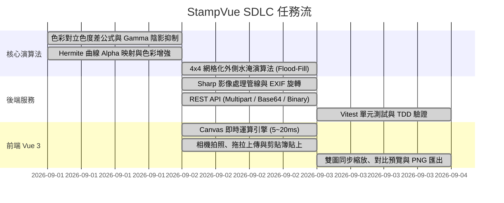

# TASKS - 印章擷取與去背系統任務拆解與進度清單 (Task Breakdown)

> **版本**：v1.1.0  
> **關聯文件**：[PRD-stamp-extractor.md](file:///d:/AI%20Agent/StampVue/docs/sdlc/PRD-stamp-extractor.md) | [SPEC-stamp-extractor.md](file:///d:/AI%20Agent/StampVue/docs/sdlc/SPEC-stamp-extractor.md)  
> **狀態**：All Completed & Verified

---

## 任務架構與縱向切片 (Vertical Slices)

---

## 任務細部狀態表

| 編號 | 階段 / 模組 | 任務描述 | 關聯檔案 | 狀態 |
|---|---|---|---|:---:|
| **T-01** | Core Algorithm | 設計色彩對立差 (Color-Opponent Diff) 計算公式與 Auto 色彩判定 | [stampExtractor.ts](file:///d:/AI%20Agent/StampVue/backend/src/services/stampExtractor.ts) | ✅ 已完成 |
| **T-02** | Core Algorithm | 實作非線性 Gamma 亮度感知陰影抑制函數 (Luminance Gamma) | [stampExtractor.ts](file:///d:/AI%20Agent/StampVue/backend/src/services/stampExtractor.ts) | ✅ 已完成 |
| **T-03** | Core Algorithm | 實作雙階濾除管線 (Two-Pass Pipeline: 70% 粗定位 + 40% 精細渲染) | [stampProcessor.ts](file:///d:/AI%20Agent/StampVue/frontend/src/utils/stampProcessor.ts) | ✅ 已完成 |
| **T-04** | Core Algorithm | 實作 4x4 網格化降採樣與外邊界水淹清除雜訊演算法 (BFS Flood-Fill) | [stampExtractor.ts](file:///d:/AI%20Agent/StampVue/backend/src/services/stampExtractor.ts) | ✅ 已完成 |
| **T-05** | Core Algorithm | 實作 Hermite Smoothstep 曲線平滑 Alpha 映射與飽和度色彩補償 | [stampExtractor.ts](file:///d:/AI%20Agent/StampVue/backend/src/services/stampExtractor.ts) | ✅ 已完成 |
| **T-06** | Backend Service | 整合 Sharp 核心載入 raw buffer、EXIF 自動旋轉與 BoundingBox 裁切 | [stampExtractor.ts](file:///d:/AI%20Agent/StampVue/backend/src/services/stampExtractor.ts) | ✅ 已完成 |
| **T-07** | Backend API | 建立 Express 路由 `/api/stamp/extract`，支援 Form-data 與 Base64 | [stampRoutes.ts](file:///d:/AI%20Agent/StampVue/backend/src/routes/stampRoutes.ts) | ✅ 已完成 |
| **T-08** | Testing (TDD) | 撰寫 Vitest 單元測試驗證純色紅印、陰影紅印與旋轉裁切邏輯 | [stampExtractor.test.ts](file:///d:/AI%20Agent/StampVue/backend/tests/stampExtractor.test.ts) | ✅ 已完成 |
| **T-09** | Frontend Engine | 將演算法完全移植至純前端 Canvas 2D / TypedArray (支援離線 60fps) | [stampProcessor.ts](file:///d:/AI%20Agent/StampVue/frontend/src/utils/stampProcessor.ts) | ✅ 已完成 |
| **T-10** | Frontend UI | 建立高擬真相機擷取元件、相機前/後鏡頭切換、檔案拖放上傳 | [CameraCapture.vue](file:///d:/AI%20Agent/StampVue/frontend/src/components/CameraCapture.vue) | ✅ 已完成 |
| **T-11** | Frontend UI | 建立參數微調面板 (門檻、陰影、平滑、飽和度、旋轉、主體邊距) | [StampControls.vue](file:///d:/AI%20Agent/StampVue/frontend/src/components/StampControls.vue) | ✅ 已完成 |
| **T-12** | Frontend UI | 實作雙向同步縮放預覽 (Pan/Zoom)、棋盤格/白底/黑底背景切換 | [ImagePreview.vue](file:///d:/AI%20Agent/StampVue/frontend/src/components/ImagePreview.vue) | ✅ 已完成 |
| **T-13** | Frontend UI | 支援一鍵無損透明 PNG 下載與系統剪貼簿複製 (Clipboard API) | [ImagePreview.vue](file:///d:/AI%20Agent/StampVue/frontend/src/components/ImagePreview.vue) | ✅ 已完成 |
| **T-14** | Core Algorithm | 實作邊界接觸元件排除與印章集中區域幾何聚類聚焦演算法 | [stampExtractor.ts](file:///d:/AI%20Agent/StampVue/backend/src/services/stampExtractor.ts) / [stampProcessor.ts](file:///d:/AI%20Agent/StampVue/frontend/src/utils/stampProcessor.ts) | ✅ 已完成 |
| **T-15** | Testing (TDD) | 撰寫邊緣拍到桌面雜訊/外圍紅線干擾之 Vitest 測試驗證 | [stampExtractor.test.ts](file:///d:/AI%20Agent/StampVue/backend/tests/stampExtractor.test.ts) | ✅ 已完成 |
| **T-16** | Core Algorithm | 實作來源差異化管線：視訊拍攝跳過 Pass 1 偵測裁切，檔案上傳保留 Pass 1 偵測裁切原圖 | [stampProcessor.ts](file:///d:/AI%20Agent/StampVue/frontend/src/utils/stampProcessor.ts) / [stampExtractor.ts](file:///d:/AI%20Agent/StampVue/backend/src/services/stampExtractor.ts) | ✅ 已完成 |
| **T-17** | UI & Testing | 前端 CameraCapture 傳遞來源標記、StampControls/Preview 視覺化標記與 TDD 單元測試 | [CameraCapture.vue](file:///d:/AI%20Agent/StampVue/frontend/src/components/CameraCapture.vue) / [stampExtractor.test.ts](file:///d:/AI%20Agent/StampVue/backend/tests/stampExtractor.test.ts) | ✅ 已完成 |
| **T-18** | Camera UI & Core | 實作視訊取景器裁切框映射投影擷取：按快門時依裁切框精準裁切視訊，再送入去背管線 | [CameraCapture.vue](file:///d:/AI%20Agent/StampVue/frontend/src/components/CameraCapture.vue) | ✅ 已完成 |
| **T-19** | Frontend UX | 隱藏照片檔案上傳模式提示條、將圖片旋轉角度控制項由步驟 2 移至步驟 3 成果檢視列 | [StampControls.vue](file:///d:/AI%20Agent/StampVue/frontend/src/components/StampControls.vue) / [ImagePreview.vue](file:///d:/AI%20Agent/StampVue/frontend/src/components/ImagePreview.vue) | ✅ 已完成 |
| **T-20** | Frontend UX | 移除複製到剪貼簿功能與按鈕，聚焦於純淨可靠之 32-bit 透明 PNG 原生下載 | [ImagePreview.vue](file:///d:/AI%20Agent/StampVue/frontend/src/components/ImagePreview.vue) | ✅ 已完成 |
| **T-21** | Frontend UX | 重構精簡排版工作室 (Compact Studio UX)：載入後收合上傳膠囊、畫布浮動旋轉工具條、高密度滑桿控制、吸底一鍵下載 | [App.vue](file:///d:/AI%20Agent/StampVue/frontend/src/App.vue) / [ImagePreview.vue](file:///d:/AI%20Agent/StampVue/frontend/src/components/ImagePreview.vue) / [CameraCapture.vue](file:///d:/AI%20Agent/StampVue/frontend/src/components/CameraCapture.vue) / [StampControls.vue](file:///d:/AI%20Agent/StampVue/frontend/src/components/StampControls.vue) | ✅ 已完成 |
| **T-22** | Frontend UX & Pipeline | 1. 移除視訊直通標籤 2. 旋轉支援直接輸入角度 3. 新影像預設以去背呈現 4. 補齊上傳相片互動取景裁切步驟 | [CameraCapture.vue](file:///d:/AI%20Agent/StampVue/frontend/src/components/CameraCapture.vue) / [ImagePreview.vue](file:///d:/AI%20Agent/StampVue/frontend/src/components/ImagePreview.vue) / [StampControls.vue](file:///d:/AI%20Agent/StampVue/frontend/src/components/StampControls.vue) | ✅ 已完成 |
| **T-23** | Frontend UX | 移除來源工具列「支援拖曳新圖覆蓋」字串、移除預覽頂部四個底色切換模式圓點 | [CameraCapture.vue](file:///d:/AI%20Agent/StampVue/frontend/src/components/CameraCapture.vue) / [ImagePreview.vue](file:///d:/AI%20Agent/StampVue/frontend/src/components/ImagePreview.vue) | ✅ 已完成 |
| **T-24** | Frontend UX & Pipeline | 1. 即時拍攝改為拍照 2. 藍印自動色彩偵測與切換 3. 印章影像來源改為印章來源 4. 去背參數微調改為去背參數 | [CameraCapture.vue](file:///d:/AI%20Agent/StampVue/frontend/src/components/CameraCapture.vue) / [StampControls.vue](file:///d:/AI%20Agent/StampVue/frontend/src/components/StampControls.vue) / [App.vue](file:///d:/AI%20Agent/StampVue/frontend/src/App.vue) / [stampProcessor.ts](file:///d:/AI%20Agent/StampVue/frontend/src/utils/stampProcessor.ts) | ✅ 已完成 |
| **T-25** | Core Algorithm & TDD | 藍印去背演算法全面升級：藍黃對立色差 (Blue-Yellow Opponent)、暗部 Gamma 補償、修復綠色通道誤植 (b*0.8 -> g*0.75)、新增真實青藍印泥 TDD 單元測試 | [stampProcessor.ts](file:///d:/AI%20Agent/StampVue/frontend/src/utils/stampProcessor.ts) / [stampExtractor.ts](file:///d:/AI%20Agent/StampVue/backend/src/services/stampExtractor.ts) / [stampExtractor.test.ts](file:///d:/AI%20Agent/StampVue/backend/tests/stampExtractor.test.ts) | ✅ 已完成 |
| **T-26** | Frontend UX & Cropper | 1. 標題改為「裁切印章」 2. 實作紅框 4 角與 4 邊正方形等比拖曳縮放 3. 按鈕改為「裁切」 4. 按鈕改為「取消」不進行去背 5. 移除引導文字 | [CameraCapture.vue](file:///d:/AI%20Agent/StampVue/frontend/src/components/CameraCapture.vue) | ✅ 已完成 |
| **T-27** | Framework Migration | 將前端專案降版遷移至 Vue 2 (Vue 2.7.16 + @vitejs/plugin-vue2)，適配 Teleport/v-model，完成編譯、型別檢查與 Dev 伺服器驗證 | [package.json](file:///d:/AI%20Agent/StampVue/frontend/package.json) / [vite.config.ts](file:///d:/AI%20Agent/StampVue/frontend/vite.config.ts) / [main.ts](file:///d:/AI%20Agent/StampVue/frontend/src/main.ts) / [CameraCapture.vue](file:///d:/AI%20Agent/StampVue/frontend/src/components/CameraCapture.vue) / [StampControls.vue](file:///d:/AI%20Agent/StampVue/frontend/src/components/StampControls.vue) | ✅ 已完成 |
| **T-28** | Frontend UX & Cropper | 在上傳相片裁切流程中增加雙維度縮放按鍵：裁切框逐步微調 (±20px) 與照片視角縮放 (50%~300% / 重設)，精確保持幾何映射無損裁切 | [CameraCapture.vue](file:///d:/AI%20Agent/StampVue/frontend/src/components/CameraCapture.vue) | ✅ 已完成 |
| **T-29** | Core UX & Parameters | 當偵測或切換為藍印時，自動套用專屬預設去背參數（高保真配置：陰影抑制 35%、靈敏度 30%）；紅印維持標準配置 (40%/40%)，重設按鈕同步支援色系預設值 | [App.vue](file:///d:/AI%20Agent/StampVue/frontend/src/App.vue) / [StampControls.vue](file:///d:/AI%20Agent/StampVue/frontend/src/components/StampControls.vue) | ✅ 已完成 |
| **T-30** | Core Algorithm & TDD | 藍色印章去背深度優化：引入動態噪聲底限 (Dynamic Noise Floor) 與紅光吸收純度檢驗，徹底解決冷光白紙與陰影殘留；修正陰影抑制因子；控制面板支援 0%~80% 且極限參數下白紙 100% 完全透明；新增冷光偏藍白紙與陰影 TDD 單元測試 | [stampProcessor.ts](file:///d:/AI%20Agent/StampVue/frontend/src/utils/stampProcessor.ts) / [stampExtractor.ts](file:///d:/AI%20Agent/StampVue/backend/src/services/stampExtractor.ts) / [StampControls.vue](file:///d:/AI%20Agent/StampVue/frontend/src/components/StampControls.vue) / [stampExtractor.test.ts](file:///d:/AI%20Agent/StampVue/backend/tests/stampExtractor.test.ts) | ✅ 已完成 |
| **T-31** | Frontend UX | 預覽區域精簡：固定保留透明棋盤底色 (Checkerboard) 與純去背成果 (Extracted)，移除預覽頂部底色與檢視切換按鍵 | [ImagePreview.vue](file:///d:/AI%20Agent/StampVue/frontend/src/components/ImagePreview.vue) | ✅ 已完成 |
| **T-32** | Algorithm & UX | 1. 徹底修復陰影抑制參數無效問題：引入暗部動態色偏雜訊底限 (Dynamic Shadow Chroma Floor) 與真實環境漫射調校，使 0%~100% 具備顯著且細膩之抑制效果，並新增 TDD 單元測試 2. 大幅加大預覽畫布高度至 520px (行動端 320~400px)，提升檢視體驗 | [stampProcessor.ts](file:///d:/AI%20Agent/StampVue/frontend/src/utils/stampProcessor.ts) / [stampExtractor.ts](file:///d:/AI%20Agent/StampVue/backend/src/services/stampExtractor.ts) / [ImagePreview.vue](file:///d:/AI%20Agent/StampVue/frontend/src/components/ImagePreview.vue) / [stampExtractor.test.ts](file:///d:/AI%20Agent/StampVue/backend/tests/stampExtractor.test.ts) | ✅ 已完成 |
| **T-33** | Frontend UX | 重新設計「印章來源」卡片 UX：統一雙態介面為高對比雙主操作排版，將「選擇照片」（印鑑紅漸層立體光暈）與「拍照」（科技藍立體光暈）按鍵放大醒目呈現，並整合底部拖放提示區 | [CameraCapture.vue](file:///d:/AI%20Agent/StampVue/frontend/src/components/CameraCapture.vue) | ✅ 已完成 |
| **T-34** | Frontend UX | 1. 移除拖曳上傳提示條 2. 移除卡片頂部「印章來源」與「已就緒」標籤，簡化為純雙按鍵操作 3. 降低預覽畫布高度至 330px 確保工作台全螢幕視野 4. 調大旋轉按鍵 (↺ 90° / ↻ 90°) 與角度輸入框尺寸與點擊區域 | [CameraCapture.vue](file:///d:/AI%20Agent/StampVue/frontend/src/components/CameraCapture.vue) / [ImagePreview.vue](file:///d:/AI%20Agent/StampVue/frontend/src/components/ImagePreview.vue) | ✅ 已完成 |
| **T-35** | Project Architecture & Cleanup | 架構審查確認系統為 100% 純客戶端 (Canvas 2D + WebRTC)，完全未調用後端 API，安全移除未使用的 `backend/` 資料夾並清理根目錄 `package.json` 指令 | [package.json](file:///d:/AI%20Agent/StampVue/package.json) / `backend/` | ✅ 已完成 |
| **T-36** | Packaging & Distribution | 將 StampVue 封裝為通用跨網頁套件：支援 ESM (`.mjs`)、UMD (`.umd.js` 全域 `StampVue`)、無頭核心 `StampProcessor`、開箱即用彈窗 `openStampModal`、Vue 元件 `StampWorkbench` 與純 HTML 範例 | [index.lib.ts](file:///d:/AI%20Agent/StampVue/frontend/src/index.lib.ts) / [vite.config.lib.ts](file:///d:/AI%20Agent/StampVue/frontend/vite.config.lib.ts) / [package.json](file:///d:/AI%20Agent/StampVue/frontend/package.json) / [index.html](file:///d:/AI%20Agent/StampVue/examples/vanilla-html/index.html) | ✅ 已完成 |
| **T-37** | Frontend UX | 調整即時視訊鏡頭取景拍照按鈕文案，將「依裁切框拍照擷取」精簡為「拍照」 | [CameraCapture.vue](file:///d:/AI%20Agent/StampVue/frontend/src/components/CameraCapture.vue) | ✅ 已完成 |
| **T-38** | Frontend UX | 1. 移除視訊頂部標題「即時鏡頭取景」 2.「裁切框尺寸」字型調大 2 級 (0.8rem -> 1.05rem, bold) 3.「將印章置於框內」移至框外下方並調大 2 級 (0.725rem -> 0.95rem) 避免遮擋印面 4.「取消」與「拍照」按鈕間隔擴大為 28px 防止誤觸 | [CameraCapture.vue](file:///d:/AI%20Agent/StampVue/frontend/src/components/CameraCapture.vue) | ✅ 已完成 |
| **T-39** | Frontend UX | 1. 移除視訊取景底部「取消」按鈕，改由右上角關閉 2. 右上角「✕」按鈕加大為 38px 圓鈕高對比發光呈現 3.「依紅框精準裁切」移至取景框上方居中標示 | [CameraCapture.vue](file:///d:/AI%20Agent/StampVue/frontend/src/components/CameraCapture.vue) | ✅ 已完成 |
| **T-40** | Frontend UX | 「選擇照片」後之「裁切印章」彈窗全面比照 CameraCapture 優化：1. 移除頂部標題「裁切印章」，僅保留醒目圓鈕「✕」 2. 取景框上方新增居中「依紅框精準裁切」提示 3. 取景框下方統一為「🎯 將印章置於框內」 4. 移除底部「取消」按鍵 5. 底部「裁切」主操作按鍵居中並加大 | [CameraCapture.vue](file:///d:/AI%20Agent/StampVue/frontend/src/components/CameraCapture.vue) | ✅ 已完成 |
| **T-41** | Frontend Theme & UX | 1. 背景與全域色彩參考 BreezySign (好好簽) 配色體系：深邃翡翠綠 `#00653e`、明亮綠 `#009149`、標題靛深藍 `#182b4d`、極簡淺白底 `#fafafc` 現代 SaaS 風格 2. 裁切框尺寸移除「縮小」與「放大」按鍵 3.「照片縮放」與「裁切框尺寸」等按鍵居中排版 4.「去背參數」之「重設」按鈕強化為醒目綠調精緻按鍵 5.「陰影抑制」與「去背強度」間隔由 6px 加大至 18px 6.「去背強度(靈敏度)」精簡更名為「去背強度」 | [style.css](file:///d:/AI%20Agent/StampVue/frontend/src/style.css) / [CameraCapture.vue](file:///d:/AI%20Agent/StampVue/frontend/src/components/CameraCapture.vue) / [StampControls.vue](file:///d:/AI%20Agent/StampVue/frontend/src/components/StampControls.vue) / [ImagePreview.vue](file:///d:/AI%20Agent/StampVue/frontend/src/components/ImagePreview.vue) / [StampModal.vue](file:///d:/AI%20Agent/StampVue/frontend/src/components/StampModal.vue) / [index.html](file:///d:/AI%20Agent/StampVue/examples/vanilla-html/index.html) | ✅ 已完成 |
| **T-42** | Frontend UX & Cropper | 1.「選擇照片」之「裁切框尺寸」規格按鈕對齊「拍照」排版：小印 (140px)、標準 (180px)、大印 (220px) 2.「照片縮放」移除「重設 (⟲)」按鈕，＋、－與 100% 指示器居中排版 3.「選擇照片」彈窗全畫面排版統一置中處理 (雙行全寬居中工具列、畫布置中、底部裁切鈕置中) | [CameraCapture.vue](file:///d:/AI%20Agent/StampVue/frontend/src/components/CameraCapture.vue) | ✅ 已完成 |
| **T-43** | Frontend UX & Cropper | 1.「選擇照片」彈窗中移除「照片縮放」字串標籤，維持 ＋/－/縮放比例居中 2. 實作照片拖曳平移 (Pan) 功能：支援滑鼠與觸控拖曳移動照片、滾輪縮放、裁切框指針事件穿透至底圖、精準映射與邊界安全鉗位計算 | [CameraCapture.vue](file:///d:/AI%20Agent/StampVue/frontend/src/components/CameraCapture.vue) | ✅ 已完成 |
| **T-44** | Frontend UX & Cropper | 實作「選擇照片」中照片旋轉功能：增加 ↺ 90° (左轉) 與 ↻ 90° (右轉) 居中控制按鍵、CSS 即時平滑旋轉動畫、逆旋轉座標映射矩陣演算、Canvas 精準無損導出正向成果 | [CameraCapture.vue](file:///d:/AI%20Agent/StampVue/frontend/src/components/CameraCapture.vue) / [index.html](file:///d:/AI%20Agent/StampVue/frontend/index.html) | ✅ 已完成 |
| **T-45** | Frontend UX | 1.「選擇照片」按鍵移除「相簿 / 檔案」副標籤字串 2.「拍照」按鍵移除「鏡頭拍攝」副標籤字串，主操作按鈕內部圖示與主文字水平居中排版 | [CameraCapture.vue](file:///d:/AI%20Agent/StampVue/frontend/src/components/CameraCapture.vue) | ✅ 已完成 |
| **T-46** | Frontend UX & Cropper | 「選擇照片」彈窗排版優化：參考主畫面（ImagePreview）佈局，將「縮放」與「旋轉」按鍵由頂部移至照片下方、「裁切」按鍵正上方，頂部統一為單行置中之「裁切框尺寸」工具列 | [CameraCapture.vue](file:///d:/AI%20Agent/StampVue/frontend/src/components/CameraCapture.vue) | ✅ 已完成 |
| **T-47** | Frontend UX | 移除主畫面（ImagePreview）底部工具列中「旋轉」與「縮放」的 reset 重設 (⟲) 按鍵，視覺控制群組更為簡潔專注 | [ImagePreview.vue](file:///d:/AI%20Agent/StampVue/frontend/src/components/ImagePreview.vue) | ✅ 已完成 |

